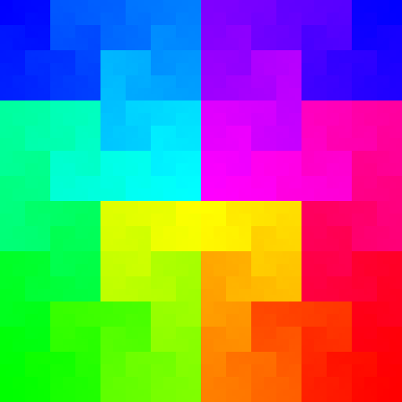
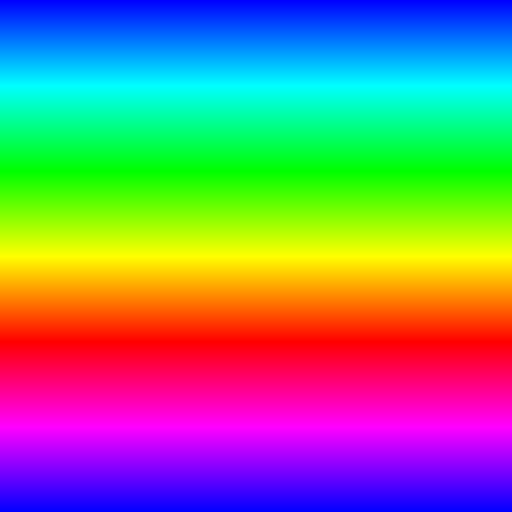
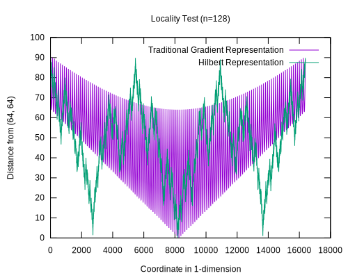
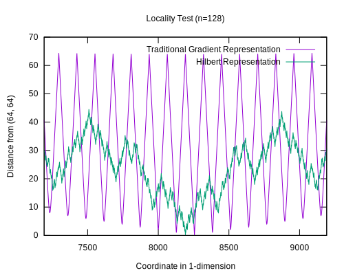
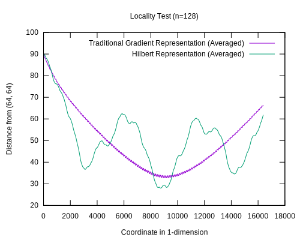
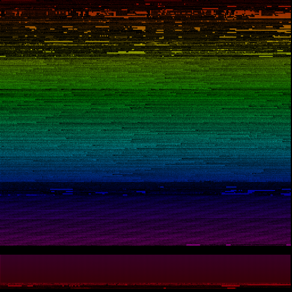

## Overview

Unicode is divided into seventeen planes. The first of these planes is plane 0,
the Basic Multilingual Plane. This plane contains most of the symbols required
to communicate in every human language. There are very few fonts with full
coverage of the Basic Multilingual Plane. GNU Unifont is one of them. Check out
<a href="http://unifoundry.com/unifont/index.html">Unifoundry.com</a> for more
information about Unifont. For a list of more fonts with good Unicode coverage,
<a href="https://en.wikipedia.org/wiki/Unicode_font">check out this Wikipedia
article</a>.

In this README I will present a method for displaying Plane 0 of a font in a PNG
image in a canonical English writing directionality, and a method using the
Hilbert curve. This will illustrate the comparatively favorable properties of
the Hilbert curve for preserving one dimensional locality in a two dimensional
grid representation.

I've structured this project into three separate programs. Use `make` to build
the programs, and `make images` to generate output.

## Visualizing the Hilbert Curve

The Hilbert curve (depicted below on the left) is a space filling curve that is
known for preserving locality when translating data from one dimension to two
dimensions. It also has a unique affinity for displaying data with "seams" on
powers of two which will become important later. The beginning of the curve is
the upper left-most blue pixel in this image, and the end of the curve is the
upper right-most blue pixel. The reason both of these are blue is because I've
colored the pixels in increasing hue values from 0° to 360°, and in this mapping
0° and 360° both correspond to `#0000ff`.

Notice that yellow pixels tend to be close to other yellow pixels, and pink ones
tend to be close to other pink ones. This is in contrast to the traditional hue
gradient method pictured on the right, where the yellow pixels are grouped up,
but because they span the entire width of the image they aren't necessarily as
close to each other as they could be. Worse is that there are discontinuities.
Pixels on the far right of a row are `width` pixels away from the very next
pixel on the far left of the row right below. Finally, there is a clear
"striation" effect that gives the image "grains" that are horizontally
polarized.

<div> </div>

## Measuring and Comparing Locality

As I have said above, one of the purported advantages of the Hilbert curve is
that it preserves locality fairly well. I wanted to measure this effect so I
wrote a C program to calculate the distance between every point in an image and
the center pixel. The ideal function would look something like a "V", or the
absolute value function centered at `8192`. In many applications, it is just as
important to preserve remoteness or separation as it is to preserve locality, so
I also wanted to keep that in mind when evaluating these methods.

<div></div>

As we can see from this graph, the traditional representation has some worrying
high frequency component to it, but besides that preserves locality fairly well.
It is also interesting to note that the Hilbert representation does not preserve
remoteness in some regions (around coordinates 3000 and 14000). Where the
Hilbert representation excels is very close to the center point where the high
frequency component of the traditional representation becomes pathological. We
can see this effect more clearly when we zoom in as shown in the next image.

<div></div>

Here, we can clearly see how detrimental the high frequency component can be to
locality preservation. There are some points that are near in one dimension but
far away in two, and vice versa. The Hilbert representation doesn't handle this
perfectly either, but this zoomed in it handles it a little better than the
Traditional representation. Finally, lets look at a graph that shows a running
average of the two curves. These averages are slightly offset due to how I
calculated them.

<div></div>

In this view, we can see that the Traditional approach does fairly well, but is
beaten by the Hilbert approach near the center, while the Hilbert approach has
its own issues near the X=3000 and X=14000 regions.

The code to gather this data can be found in TODO.

## Reconstructing the Canonical Font Visualization

Now that I've established what the Hilbert curve is and why we would want to use
it, it is time to have a discussion about font visualization. I'm going to be
using the <a href="https://www.cairographics.org/">Cairo graphics library</a> to
render these examples because it is simple, pretty much everyone has it on their
computer, and it can write to several different target formats including
PostScript, SVG, and PNG. I'd normally go for an SVG output for this kind of
work, but because Unifont is fundamentally a bitmap font I have decided to use
the raster format (PNG).

There are two implementation details that I want to go over. The first is
conversion from Unicode codepoints to UTF-8. This is done using a code snippet
that I found on Stack Overflow (link in the source code below). The tricky part
here is that different codepoints have different length UTF-8 representations
(between one and four bytes inclusive).

The other implementation detail is the coloring I'm using. Just as in the
demonstrations above, I'm representing the one dimensional data by mapping it
onto a hue value that goes from 0° to 360°. The algorithm to do this is quite
simple even though it has this weird piecewise nature to it that always gives me
the creeps. It just seems <em>wrong</em> to have a switch statement (or any
control flow for that matter) in a calculation like this. Again, the link is in
the code below.

As we can see from the visualization, there are a lot of striations in the data,
like grains in a block of wood. This is generally a decent representation of the
data because it is easy to derive the codepoint of each symbol from the position
it occupies on the grid. In the next section, we will modify this visualization
to map onto the Hilbert curve instead.

<a href="./res/canonical_unifont.png"><div></div></a>

## Dependencies

```
gcc
libcairo2-dev
make
```

## Examples

This is the Hilbert Curve, it is rendered here as a hue gradient, and starts in
the upper left hand corner and ends in the upper right.


This is Unifont arranged in a traditional left-to-right, top-to-bottom fashion.
This arrangement causes artifacts like horizontal banding.


This is Unifont arranged along the Hilbert Curve. This arrangement groups
together similar groups of characters. This is especially useful for groups that
are divided on powers of two as Unicode's Plane 0 is.


## Credits

Information about the Hilbert Curve, including the algorithm for translating
between one- and two-dimensional representations of the curve were found in the
[Wikipedia article for the Hilbert Curve](https://en.wikipedia.org/wiki/Hilbert_curve).

Code that was used for cycling through UTF codepoints was based on
[this Stack Overflow post](https://stackoverflow.com/questions/38491380/how-to-print-unicode-codepoints-as-characters-in-c).

Code for converting between RGB and HSV representations of color was based on
[this file on GitHub](https://github.com/Inseckto/HSV-to-RGB/blob/master/HSV2RGB.c).

## License

This work is licensed under the GNU General Public License version 3 (GPLv3).

[](https://www.gnu.org/licenses/gpl-3.0.en.html)
